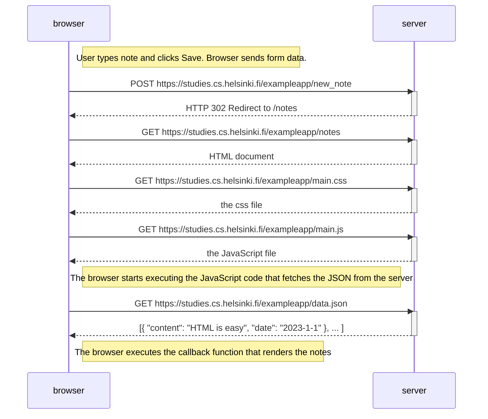
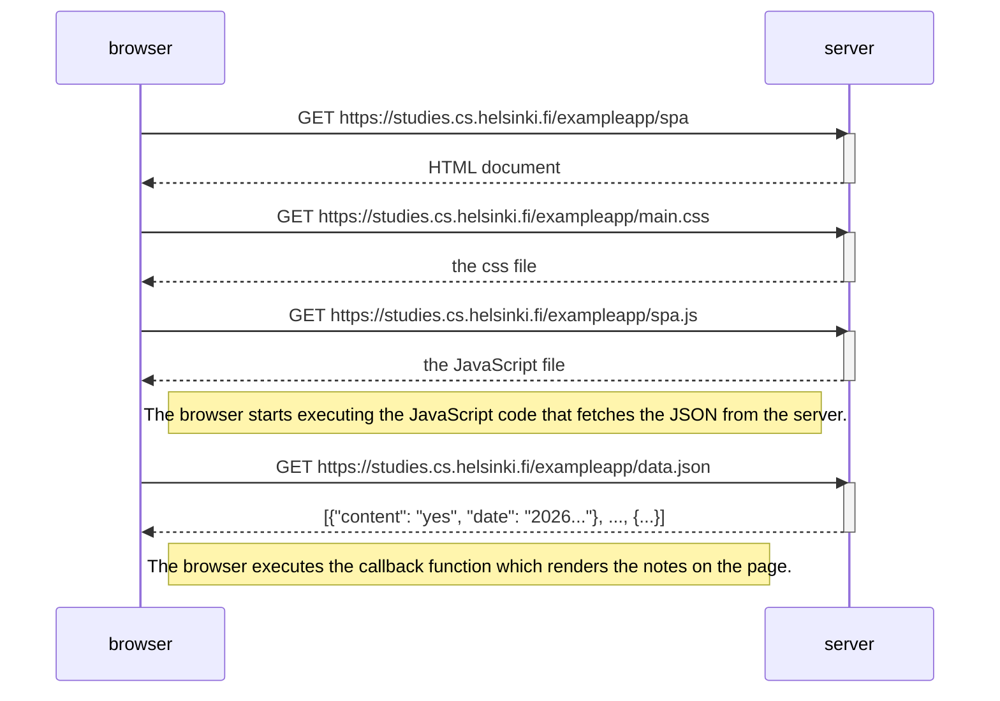

### 0.4: New note diagram



### 0.5: Single page app diagram


### 0.6: New note in Single page app diagram

```mermaid
    sequenceDiagram
        participant browser
        participant server

        Note right of browser: The browser intercepts the form submit event. It prevents the default page reload. The JS updates the UI locally first to show the new note instantly.

        browser->>server: POST https://studies.cs.helsinki.fi/exampleapp/new_note_spa
        activate server

        Note right of browser: The payload is sent as JSON

        server-->>: HTTP status 201 (created)
        deactivate server

        Note right of browser: The server responds with 201, confirming the data was saved. No redirect is issued. No CSS/JS is re-fetched.
```